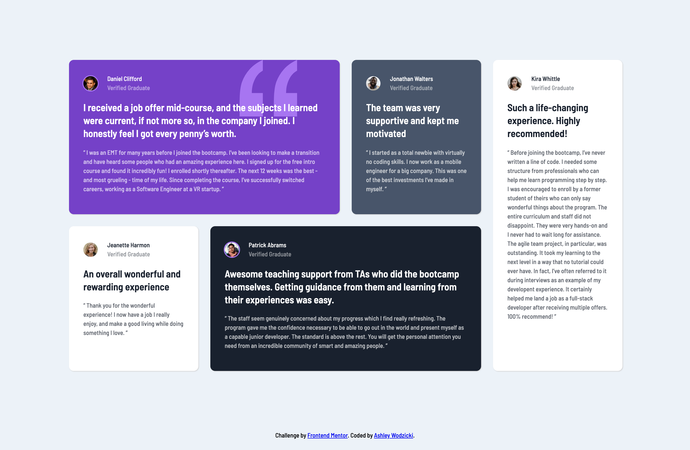

# Frontend Mentor - Testimonials grid section solution

This is a solution to the [Testimonials grid section challenge on Frontend Mentor](https://www.frontendmentor.io/challenges/testimonials-grid-section-Nnw6J7Un7). Frontend Mentor challenges help you improve your coding skills by building realistic projects.

## Table of contents

- [Overview](#overview)
  - [The challenge](#the-challenge)
  - [Screenshot](#screenshot)
  - [Links](#links)
- [My process](#my-process)
  - [Built with](#built-with)
  - [What I learned](#what-i-learned)
  - [Continued development](#continued-development)
- [Author](#author)

## Overview

### The challenge

Users should be able to:

- View the optimal layout for the site depending on their device's screen size

### Screenshot

### Links

- Solution URL: [Add solution URL here](https://your-solution-url.com)
- Live Site URL: [Add live site URL here](https://your-live-site-url.com)

## My process
- I used a mobile-first approach to start this project. I began with the HTML5 markup and organized the testimonials into blocks using divs. I knew they blocks would need various background colors so I first assigned a general class to each testimonial block with the correct border-radius, padding, and box-shadow. Then I created classes for the various background colors and assigned them to the correct testimonial blocks. Then, I created a flexbox container to align the user image, name, and title horizontally in the testimonial block.
- I was excited to complete the desktop version of this design utilizing CSS grid. I set up a 4 column by 2 row grid and used grid-area to align the testimonial blocks based on the design.
- I originally used the background color classes for the testimonial blocks to align them in the grid area. After considering issues that might arise if I added more testimonial blocks to the page, I decided to review my code and create a grid-template-area that specified areas using testimonial names. That way, if another testimonial block was styled and added to the page, I could easily designate another grid-template-area row and assign the block a new area, without affecting the styling. This also helped reduce the confusion between the two testimonial blocks with white backgrounds.

### Built with

- Semantic HTML5 markup
- CSS custom properties
- Flexbox
- CSS Grid
- Mobile-first workflow

### What I learned

- This project was a great opportunity to reinforce my knowledge of CSS grid and using grid-areas to place items in the grid.
- Utilizing grid in this project also helped me spend less time on margin and padding between divs. In previous projects I would spend a lot of time getting styles like padding and line spacing exactly like the design. Using grid helped reduce my time spend on spacing out divs because I used grid-gap to easily space the divs. I plan to utilize grid-gap more in my mobile designs going forward.

### Continued development

- I am eager to continue working with CSS grid and learn more about templates and theory behind placing items in the grid container.

## Author

- Ashley Wodzicki
- Frontend Mentor - [@alwodzicki](https://www.frontendmentor.io/profile/alwodzicki)
- Twitter - [@ashwodz](https://www.twitter.com/ashwodz)
- Freecodecamp - [@awodzicki](https://www.freecodecamp.org/awodzicki)
